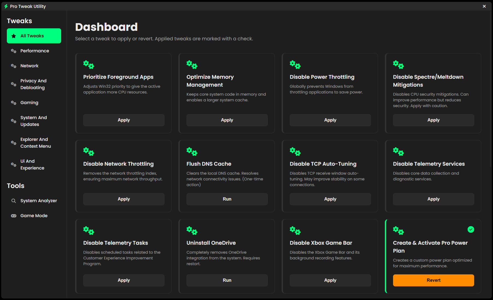

<div align="center">


\ ⚡ Pro Tweak Utility ⚡


<p>

&nbsp; 

&nbsp; 

&nbsp; 

</p>


A sleek and powerful Windows optimization tool that allows users to apply and revert system tweaks safely through a modern, web-based interface.


<br>





</div>


<details>

&nbsp; <summary><strong>Table of Contents</strong></summary>

&nbsp; <ol>

&nbsp;   <li><a href="#-about-the-project">About The Project</a></li>

&nbsp;   <li><a href="#-core-features">Core Features</a></li>

&nbsp;   <li><a href="#-technologies-used">Technologies Used</a></li>

&nbsp;   <li><a href="#-getting-started">Getting Started</a></li>

&nbsp;   <li><a href="#-project-structure">Project Structure</a></li>

&nbsp;   <li><a href="#-roadmap">Roadmap</a></li>

&nbsp;   <li><a href="#-license">License</a></li>

&nbsp; </ol>

</details>


---


\## 📖 About The Project


Pro Tweak Utility is designed to provide a simple yet robust solution for Windows users looking to optimize their system for performance, gaming, privacy, and more. Unlike scripts that apply changes blindly, this tool stores the original state of every tweak, allowing for safe, one-click rollbacks.


The application leverages a modern frontend built with standard web technologies, wrapped in a lightweight Python backend, making it both visually appealing and easy to extend. All tweaks are defined in an external JSON file, so new optimizations can be added without ever touching the core application code.


---


\## ✨ Core Features


\*   \*\*Extensive Tweak Library:\*\* Comes pre-loaded with dozens of tweaks across categories like Performance, Network, Privacy, Gaming, and UI.

\*   \*\*Safe Apply \& Revert:\*\* Automatically backs up the original settings before applying any tweak, ensuring you can revert changes at any time.

\*   \*\*System Analyzer:\*\* Includes a tool that scans for common areas of improvement and suggests recommended tweaks.

\*   \*\*Modern User Interface:\*\* A clean, responsive GUI built with HTML, CSS, and JavaScript provides a superior user experience.

\*   \*\*JSON-Powered:\*\* All tweaks are loaded from a `tweaks.json` file, making it incredibly easy for the community to add or modify optimizations.

\*   \*\*Lightweight \& Portable:\*\* Built with `pywebview`, the tool is a lightweight wrapper around a webview, requiring minimal dependencies.


---


\## 🛠️ Technologies Used


\*   \*\*Python 3\*\*

\*   \*\*PyWebView\*\* (for the GUI wrapper)

\*   \*\*HTML5, CSS3, JavaScript\*\* (for the user interface)


---


\## 🚀 Getting Started


Follow these simple steps to get the tweak utility running on your local machine.


\### Prerequisites


\*   Python 3.8 or newer. You can download it from \[python.org](https://www.python.org/).

\*   Windows Operating System.


\### Installation \& Usage


1\.  \*\*Clone the repository:\*\*

&nbsp;   ```sh

&nbsp;   git clone https://github.com/RylieHolmes/Pro-Tweak-Utility.git

&nbsp;   ```

2\.  \*\*Navigate to the project directory:\*\*

&nbsp;   ```sh

&nbsp;   cd Pro-Tweak-Utility

&nbsp;   ```

3\.  \*\*Install the required Python packages:\*\*

&nbsp;   ```sh

&nbsp;   pip install pywebview

&nbsp;   ```

4\.  \*\*Run the application:\*\*

&nbsp;   \*You must run the script as an Administrator for the tweaks to work.\*

&nbsp;   ```sh

&nbsp;   python app.py

&nbsp;   ```

&nbsp;   The application window will appear, and you can start applying tweaks.


---


\## 📂 Project Structure


The project is organized with a clear separation between the backend logic and the frontend interface:


\*   `app.py`: The main Python backend. It handles all the core logic, such as applying/reverting tweaks, reading JSON files, and managing the application window. It also serves as the API for the frontend.

\*   `tweaks.json`: A JSON file containing the definitions for all available tweaks. Each entry includes a title, description, and the specific actions (e.g., registry changes, commands) to perform.

\*   `web/`: This directory contains all the frontend files.

&nbsp;   \*   `index.html`: The main structure of the user interface.

&nbsp;   \*   `style.css`: All the styling rules to make the application look clean and modern.

&nbsp;   \*   `script.js`: The frontend JavaScript that handles user interactions, calls the Python API, and dynamically updates the UI.


---


\## 🗺️ Roadmap


This project has a solid foundation that can be extended in many exciting ways:


\*   \[x] System Analyzer for recommended tweaks.

\*   \[ ] \*\*Game Mode:\*\* Implement the "Game Mode" feature, which automatically applies a set of gaming-related tweaks when a specified game executable is launched.

\*   \[ ] \*\*Tweak Profiles:\*\* Allow users to save and load custom profiles of their favorite tweaks.

\*   \[ ] \*\*More Tweaks:\*\* Continuously expand the `tweaks.json` library with new and useful optimizations.

\*   \[ ] \*\*Detailed Logging:\*\* Add a logging system to provide more feedback on the actions being performed.


---


\## 📄 License


Distributed under the MIT License. See `LICENSE` for more information.

